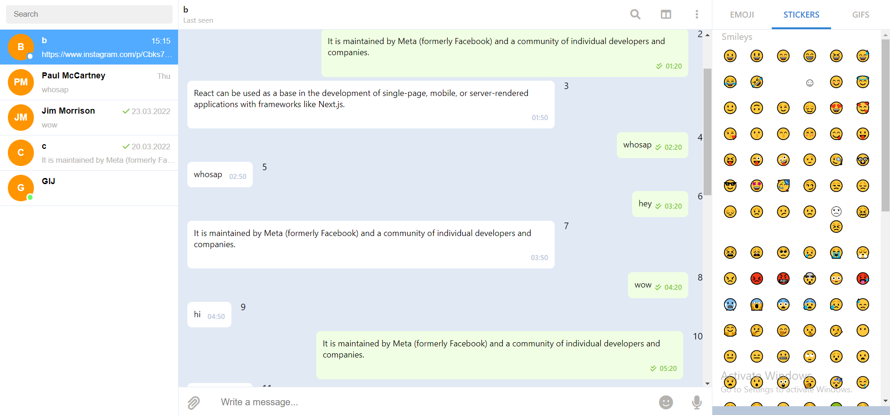
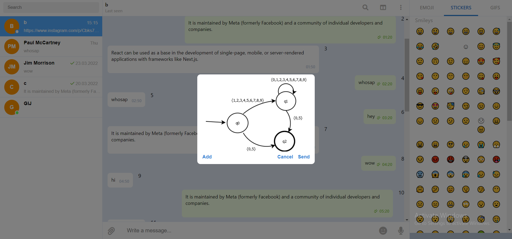

##Telegram clone

This is my pet project aimed at implementing the main functionality of Telegram.

DISLAIMER! This project is only on the initial stage of development, so there are few Telegram features that actually work.

See the app live: [https://telegram-xd.herokuapp.com](https://telegram-xd.herokuapp.com)

Login, password: a, a

###Scripts

To run the client:

```
cd client 
npm install
npm start
```

To run the server:

```
cd server
npm install
ts-node index
```

### Client

On the client, I am mainly cloning the interface of Telegram Desktop, not Telegram Web.

As of now, the user can send messages and photos, see who is online and when his messages are seen by the recipient.

I use React, Redux Toolkit and TypeScript for development.

Default interface:



Photo sending form:



### Server

On the server, I use Express, Socket.io and Typescript.

As for the database, I am currently storing data locally, but I am planning to add MySQL soon.
